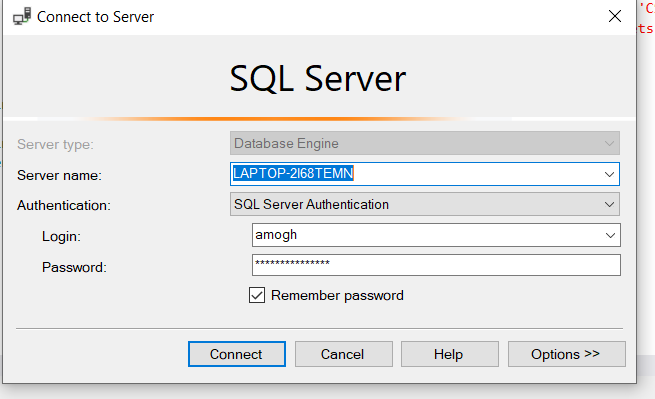
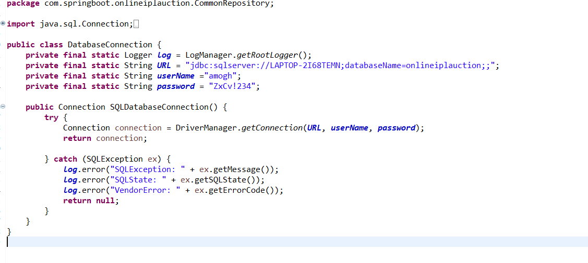

# Group21-Project
# iplAuction

#Database Connection:
Inside the folder we have a file names Queries.sql and you can run connect to mySql as SQl Servre Authentication using your username and password and run the script to create table.

Note: Make Sure TCP/IP is enabled and all SQL servers are running in Services.

#API Connection:
The entire src folder has all the functionallity. Go to src/main/java/com/springboot/onlineiplauction/CommonRepository/DatabaseConnection.java and update The ConnectionString using your server name
Update the URL : jdbc:sqlserver://[ServerName];databaseName=onlineiplauction; and username and paswword.

Note: Make Sure TCP/IP is enabled and all SQL servers are running in Services.

#FrontEnd:
Just run the index.html
